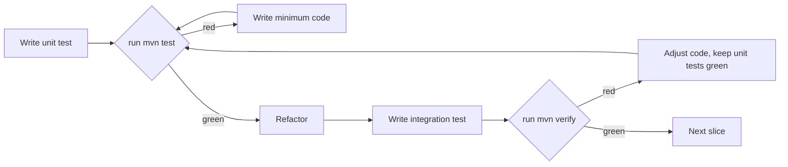

# FinRisk TDD Implementation Plan

Strict source of truth: `[uml.md](uml.md)` (sections 2-12) and `[openapi.yaml](openapi.yaml)`. Every public type/path must match those documents.

Tech (locked):

- Java 21, Maven, Spring Boot 3.3 (`spring-boot-starter-web`, `spring-boot-starter-validation`, **no JPA**)
- DAO layer: raw JDBC + HikariCP, mssql-jdbc driver
- Test stack: JUnit 5, Mockito, AssertJ, Spring `MockMvc`, RestAssured
- DB: `mcr.microsoft.com/mssql/server:2022-latest` from docker-compose, two databases: `FinRiskDB` (dev) + `FinRiskDB_Test` (integration tests)
- Migrations: plain SQL files applied by a small `db/scripts/apply-migrations.sh` that uses `sqlcmd` in the running container

---

## TDD loop (applied to every slice)

Layer split:

- **Unit tests** (`*Test.java`, `mvn test`, Surefire): mock collaborators. Cover Service, Controller (`@WebMvcTest`), Mapper, Factory, Strategy.
- **Integration tests** (`*IT.java`, `mvn verify`, Failsafe): real `FinRiskDB_Test`. Cover JDBC DAOs and full HTTP-to-DB happy paths via RestAssured.

---

## Phase 1 - Database on Docker (no Java yet)

Deliverables:

- `docker-compose.yml` - one `sqlserver` service on `:1433`, named volume, healthcheck via `sqlcmd -Q "SELECT 1"`.
- `.env.example` - `SA_PASSWORD`, `DB_USER`, `DB_PASSWORD`, `DB_NAME=FinRiskDB`, `DB_TEST_NAME=FinRiskDB_Test`.
- `db/migrations/`:
  - `V1__schema.sql` - all tables/constraints from `[uml.md](uml.md)` section 7 + original brief sections 6-9: `users`, `accounts`, `assets`, `asset_details_stock`, `asset_details_bond`, `asset_details_crypto`, `transactions`, `audit_logs`, `asset_price_history`. **Add an `asset_details_etf` table** (issuer, expense_ratio) to round out the inheritance from the UML.
  - `V2__indexes.sql` - all indexes from original brief section 10.
  - `V3__views.sql` - `vw_portfolio_holdings`, `vw_portfolio_summary`, `vw_portfolio_profit_loss` from sections 11.
  - `V4__procedures.sql` - `sp_buy_asset`, `sp_sell_asset` from section 12.
- `db/seed/seed.sql` - 1 user, 1 account, 4 assets (one per type), ~30 price-history points per asset (so the `VolatilityRiskStrategy` has real data).
- `db/scripts/apply-migrations.sh` - applies migrations to a target DB name (parameter), used for both `FinRiskDB` and `FinRiskDB_Test`.

DB-level smoke checks (also part of the TDD spirit, before any Java is written):

- `db/scripts/smoke.sh` - executes `EXEC sp_buy_asset @account_id=1, @asset_id=1, @quantity=10, @unit_price=180.0;`, then asserts row exists in `transactions`, `cash_balance` was debited, `audit_logs` has a `BUY_TRANSACTION_CREATED` row. Expected to **pass before** Phase 2 begins.

Exit criteria for Phase 1: `docker compose up -d sqlserver && bash db/scripts/apply-migrations.sh FinRiskDB && bash db/scripts/apply-migrations.sh FinRiskDB_Test && bash db/scripts/smoke.sh` returns 0.

---

## Phase 2 - Project skeleton + cross-cutting (still TDD-ready)

Deliverables:

- `pom.xml` - JDK 21, Spring Boot 3.3, mssql-jdbc, HikariCP (transitively), JUnit 5, Mockito, AssertJ, RestAssured, Surefire (`*Test`), Failsafe (`*IT`).
- `src/main/java/com/finrisk/` package layout matching `[uml.md](uml.md)` section 2 exactly:
  - `FinRiskApplication.java`
  - `config/` (`DatabaseConnection.java` Singleton wrapping HikariDataSource, `JacksonConfig.java`)
  - `controller/`, `service/`, `dao/` (+ `dao/impl/`), `model/`
  - `dto/request/`, `dto/response/`
  - `mapper/`, `factory/`, `strategy/risk/`, `exception/`
- `exception/` - `DaoException`, `AccountNotFoundException`, `AssetNotFoundException`, `UserNotFoundException`, `InsufficientBalanceException`, `InsufficientQuantityException`, `InvalidTransactionException`, `EmailAlreadyExistsException`, `SymbolAlreadyExistsException`.
- `controller/GlobalExceptionHandler.java` (`@ControllerAdvice`) - maps each exception to the status codes and `Error` schema in `[openapi.yaml](openapi.yaml)`.
- `dto/response/Page.java` - matches the `PageMeta`+`content` envelope from `openapi.yaml`.
- `src/main/resources/application.yml` + `application-test.yml` - DB URL from env, second profile pointing at `FinRiskDB_Test`.

No business logic yet. The skeleton must compile and `mvn test` must pass with zero tests.

---

## Phase 3 - Vertical slices, one TDD cycle per slice

Each slice is implemented in this exact order: **unit tests -> code -> integration tests -> code adjustments**. Slices are ordered by dependency.

### Slice A - Users

- Unit: `UserMapperTest`, `UserServiceTest` (mock `UserDao`), `UserControllerTest` (`@WebMvcTest`, asserts every status code + `Error` payload from `openapi.yaml` for `POST /api/v1/users`, `GET /api/v1/users/{id}`, `GET /api/v1/users` with pagination).
- Code: `User`, `UserCreateRequest`, `UserResponse`, `UserMapper`, `UserDao`, `UserDaoJdbc`, `UserService`, `UserController`.
- Integration: `UserDaoJdbcIT` against `FinRiskDB_Test` - covers `save`, `findById`, `findByEmail`, unique-email violation -> `EmailAlreadyExistsException`. `UserApiIT` (RestAssured) hits the real running app.

### Slice B - Accounts (cash flows, no trading yet)

- Unit: `AccountServiceTest` (mock `AccountDao`, `UserDao`), `AccountControllerTest` for `POST /accounts`, `GET /accounts/{id}`, `POST /deposit`, `POST /withdraw`, `GET /users/{userId}/accounts`.
- Code: `Account`, request/response DTOs, `AccountMapper`, `AccountDao`, `AccountDaoJdbc` (uses parameterized SQL, `updateCashBalance` is its own method to keep it atomic), `AccountService` enforcing `cashBalance >= 0` -> `InsufficientBalanceException`.
- Integration: `AccountDaoJdbcIT` (incl. CHECK constraint behavior), `AccountApiIT`.

### Slice C - Assets (polymorphic + Factory)

- Unit: `AssetFactoryTest` (input request -> correct `Stock`/`ETF`/`Bond`/`CryptoAsset`, missing subtype payload -> `IllegalArgumentException` -> 400), `AssetMapperTest` (subtype joins -> correct `oneOf` JSON shape with `assetType` discriminator), `AssetServiceTest`, `AssetControllerTest` covering `oneOf`/`discriminator` request bodies from `openapi.yaml`.
- Code: `Asset` abstract + 4 subclasses (Template Method `calculateRiskLevel()` returns the per-type default: STOCK=HIGH, BOND=LOW, CRYPTO=VERY_HIGH, ETF=MEDIUM), `AssetFactory`, `AssetDao` + `AssetDaoJdbc` doing the multi-table read (LEFT JOIN to each `asset_details`_*).
- Integration: `AssetDaoJdbcIT` (round-trip per subtype), `AssetApiIT`.

### Slice D - Asset prices + history

- Unit: `AssetPriceServiceTest` for `PUT /assets/{id}/price` (updates current_price + inserts history row in one DAO call), pagination on `GET /assets/{id}/price-history`.
- Code: `AssetPriceHistoryDao`, `AssetPriceHistoryDaoJdbc`, extension on `AssetService`.
- Integration: `AssetPriceHistoryDaoJdbcIT`, `AssetPriceApiIT`.

### Slice E - Transactions (the core business logic)

- Unit: `TransactionFactoryTest`, `TransactionServiceTest` covering the full decision tree:
  - Account missing -> `AccountNotFoundException` -> 404
  - Asset missing -> `AssetNotFoundException` -> 404
  - Buy with insufficient cash -> `InsufficientBalanceException` -> 409
  - Sell with insufficient quantity -> `InsufficientQuantityException` -> 409
  - Happy paths return the `TransactionResponse` shape from `openapi.yaml`
- `TransactionControllerTest` for `POST /transactions/buy`, `POST /transactions/sell`, `GET /accounts/{id}/transactions` (with `type`, `assetId`, `from`, `to`, pagination).
- Code: `BuyTransaction`/`SellTransaction` + `applyTo(Account, Asset)` Template Method, `TransactionFactory`, `TransactionDao`, `TransactionDaoJdbc`. `TransactionService.buy/sell` runs the buy/sell flow inside a JDBC transaction (`connection.setAutoCommit(false); commit()/rollback()`), with two implementation paths to match the brief:
  - Default: call `sp_buy_asset` / `sp_sell_asset` (matches the brief verbatim).
  - Alternate path documented but not used: pure-Java orchestration of the same SQL, behind the same `TransactionDao` interface, so we can demonstrate the design without losing the stored procedure work.
- Integration: `TransactionDaoJdbcIT` (uses the stored procedure path, asserts cash balance, transactions row, and `audit_logs` row are all written or all rolled back), `TransactionApiIT`.

### Slice F - Portfolio (`GET /accounts/{id}/portfolio`)

- Unit: `PortfolioServiceTest`, `PortfolioControllerTest` (response shape strictly per `PortfolioResponse`).
- Code: `PortfolioDao` reading from `vw_portfolio_holdings`, `PortfolioMapper`, `PortfolioService` summing cash + holdings.
- Integration: `PortfolioApiIT` - seed data, buy/sell, then assert holdings + totals.

### Slice G - Profit/Loss (`GET /accounts/{id}/profit-loss`)

- Unit: `ProfitLossServiceTest` covers `profitLoss = currentValue - netInvested` and `profitLossPercent` rounding.
- Code: reads `vw_portfolio_profit_loss`.
- Integration: `ProfitLossApiIT`.

### Security Review

Slice H - Risk (Strategy)

- Unit: `VolatilityRiskStrategyTest` (deterministic input price arrays -> exact stddev -> exact `RiskLevel` per the table in `[uml.md](uml.md)` section 6.5; <5 samples -> falls back to the asset's default), `RiskServiceTest` (value-weighted average, normalization to 0..100, `RiskScoreResponse` shape exactly per `openapi.yaml`).
- Code: `RiskCalculationStrategy` interface + `VolatilityRiskStrategy` impl, `RiskService` injecting the strategy via constructor (Spring `@Bean` in `config/StrategyConfig.java`).
- Integration: `RiskApiIT` - seed price history with known volatility, hit `GET /accounts/{id}/risk`, assert `score` and `level`.

---

## Phase 4 - Dockerize the API + end-to-end test script

Deliverables:

- `Dockerfile` - multi-stage (`maven:3.9-eclipse-temurin-21` build -> `eclipse-temurin:21-jre` runtime), runs `java -jar app.jar`.
- Add `finrisk-api` service to `docker-compose.yml` per `uml.md` section 17 (depends_on `sqlserver` healthy).
- `scripts/e2e.sh` - the "A-Z" runner the user asked for. Steps:
  1. `docker compose down -v && docker compose up -d sqlserver`
  2. Wait for healthy (poll `sqlcmd SELECT 1`).
  3. `bash db/scripts/apply-migrations.sh FinRiskDB`
  4. `bash db/scripts/apply-migrations.sh FinRiskDB_Test`
  5. `mvn -B test` (unit tests, must be green).
  6. `mvn -B verify -DskipUnitTests=false` (integration tests against `FinRiskDB_Test`, must be green).
  7. `bash db/scripts/seed.sh FinRiskDB`
  8. `docker compose up -d --build finrisk-api` and wait for `GET /actuator/health` (or root) to return 200.
  9. `bash scripts/e2e-happy-path.sh` - RestAssured-equivalent in pure curl/jq, hits, in order: create user -> create account -> deposit -> create stock -> update price -> buy 10 -> get portfolio (assert quantity=10) -> sell 4 -> get P&L -> get risk -> assert each response status and a couple of body fields.
  10. `docker compose down`.
- `README.md` - one-page "how to run", lists `make dev`, `make test`, `make e2e`.

Exit criteria: `bash scripts/e2e.sh` returns 0 on a clean machine with only Docker + Maven + JDK 21 installed.

---

## Order of execution / file-creation checklist

1. `docker-compose.yml`, `.env.example`
2. `db/migrations/V1__schema.sql` -> `V4__procedures.sql`, `db/seed/seed.sql`, `db/scripts/apply-migrations.sh`, `db/scripts/smoke.sh`
3. **Run Phase 1 exit check.**
4. `pom.xml`, package skeleton, `application.yml`, `GlobalExceptionHandler`, `Page<T>`, `DatabaseConnection`
5. Slices A -> H, each one: write `*Test`, see it red, write code, see it green, refactor, write `*IT`, see it red, adjust, see it green.
6. `Dockerfile`, add `finrisk-api` to compose, `scripts/e2e.sh`, `scripts/e2e-happy-path.sh`
7. **Run Phase 4 exit check.**

---

## What I am NOT doing (explicit non-goals)

- No authentication, no JWT, no Spring Security.
- No JPA / Hibernate / Spring Data - DAOs are hand-written JDBC with `try-with-resources`.
- No multi-currency - everything is USD per the locked decision.
- No advanced risk math beyond the volatility strategy described in `[uml.md](uml.md)` section 6.5.
- No frontend.
- No CI workflow file (can be added later; out of scope for this round).

