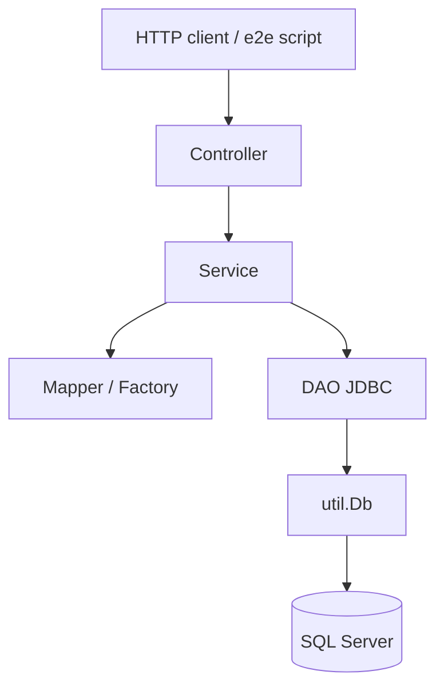

# FinRisk — Happy path simulation (jury walkthrough)

This document follows the same sequence as `scripts/e2e-happy-path.sh` and the Postman collection `postman/FinRisk-E2E-Happy-Path.postman_collection.json`. Use it to show **which function runs** at each HTTP step, from the REST controller down to JDBC or stored procedures.

## Quick start

```bash
# API running (local or Docker on port 18080)
export BASE_URL=http://localhost:18080
bash scripts/e2e-happy-path.sh
```

Expected final line: `e2e happy path OK`.

## Request flow (layers)



| Layer | Role in the happy path |
|-------|------------------------|
| **Controller** | Maps URL + JSON to a service call; sets HTTP status |
| **Service** | Business rules, validation, orchestration |
| **Mapper / Factory** | DTO ↔ domain; builds the right `Asset` subtype |
| **DAO** | SQL and stored procedures via raw JDBC |
| **`Db`** | Connection, `PreparedStatement`, `CallableStatement`, row mapping |

---

## Step 1 — Create user

**HTTP:** `POST /api/v1/users`  
**Body:** `{ "fullName": "E2E User", "email": "e2e-…@example.com" }`  
**Response:** `201` with `{ "id", "fullName", "email", "createdAt" }`

### Call chain

1. `UserController.create` → `UserService.createUser`
2. `UserMapper.toDomain` → `UserDao.save` → `UserMapper.toResponse`

### Code to show

```32:36:src/main/java/com/finrisk/controller/UserController.java
    /** POST creating a user with validated body. */
    @PostMapping
    @ResponseStatus(HttpStatus.CREATED)
    public UserResponse create(@Valid @RequestBody UserCreateRequest req) {
        return userService.createUser(req);
```

```33:37:src/main/java/com/finrisk/service/UserService.java
    public UserResponse createUser(UserCreateRequest req) {
        User user = UserMapper.toDomain(req);
        User saved = userDao.save(user);
        return UserMapper.toResponse(saved);
    }
```

```13:20:src/main/java/com/finrisk/mapper/UserMapper.java
    public static User toDomain(UserCreateRequest req) {
        return new User(null, req.fullName(), req.email().trim().toLowerCase(), null);
    }

    public static UserResponse toResponse(User u) {
        return new UserResponse(u.id(), u.fullName(), u.email(), u.createdAt());
    }
```

**Database:** `INSERT INTO dbo.users … OUTPUT INSERTED.id` in `UserDaoJdbc`.

---

## Step 2 — Create account

**HTTP:** `POST /api/v1/accounts`  
**Body:** `{ "userId": <USER_ID>, "accountName": "Primary", "initialDeposit": 100000 }`

### Call chain

1. `AccountController.create` → `AccountService.createAccount`
2. `UserDao.findById` (owner must exist)
3. `AccountMapper.toNewAccount` → `AccountDao.save` → `AccountMapper.toResponse`

### Code to show

```33:37:src/main/java/com/finrisk/controller/AccountController.java
    @PostMapping("/accounts")
    @ResponseStatus(HttpStatus.CREATED)
    public AccountResponse create(@Valid @RequestBody AccountCreateRequest req) {
        return accountService.createAccount(req);
    }
```

```41:49:src/main/java/com/finrisk/service/AccountService.java
    public AccountResponse createAccount(AccountCreateRequest req) {
        User owner = userDao.findById(req.userId());
        if (owner == null) {
            throw new UserNotFoundException("Owning user not found");
        }
        Account account = AccountMapper.toNewAccount(req);
        Account saved = accountDao.save(account);
        return AccountMapper.toResponse(saved);
    }
```

**Outcome:** Account row linked to `userId` with starting cash balance.

---

## Step 3 — Deposit cash

**HTTP:** `POST /api/v1/accounts/{accountId}/deposit`  
**Body:** `{ "amount": 50000 }`

### Call chain

1. `AccountController.deposit` → `AccountService.deposit`
2. `AccountDao.findById` → add amount → `AccountDao.updateCashBalance`

### Code to show

```46:49:src/main/java/com/finrisk/controller/AccountController.java
    @PostMapping("/accounts/{id}/deposit")
    public AccountResponse deposit(@PathVariable long id, @Valid @RequestBody CashMovementRequest req) {
        return accountService.deposit(id, req);
    }
```

```95:102:src/main/java/com/finrisk/service/AccountService.java
    public AccountResponse deposit(long accountId, CashMovementRequest req) {
        Account account = requireAccount(accountId);
        BigDecimal nextBalance = account.cashBalance().add(req.amount());
        accountDao.updateCashBalance(accountId, nextBalance);
        return AccountMapper.toResponse(account.withCashBalance(nextBalance));
    }
```

**Outcome:** Cash balance increases (initial deposit + 50 000 in the e2e script).

---

## Step 4 — Create stock asset

**HTTP:** `POST /api/v1/assets`  
**Body:** `{ "assetType": "STOCK", "symbol": "E2E", "name": "E2E Corp", "currentPrice": 50, … }`

### Call chain

1. `AssetController.create` → `AssetService.createAsset`
2. **`AssetFactory.create`** (Factory pattern — picks `Stock`, `ETF`, `Bond`, or `CryptoAsset`)
3. `AssetDao.save` → `AssetPriceHistoryDao.insert` (first price point)

### Code to show

```48:52:src/main/java/com/finrisk/controller/AssetController.java
    @PostMapping
    @ResponseStatus(HttpStatus.CREATED)
    public AssetResponse create(@Valid @RequestBody AssetCreateRequest req) {
        return assetService.createAsset(req);
    }
```

```40:45:src/main/java/com/finrisk/service/AssetService.java
    public AssetResponse createAsset(AssetCreateRequest req) {
        Asset asset = AssetFactory.create(req);
        Asset saved = assetDao.save(asset);
        assetPriceHistoryDao.insert(saved.id(), saved.currentPrice());
        return AssetMapper.toResponse(assetDao.findById(saved.id()));
    }
```

```24:35:src/main/java/com/finrisk/factory/AssetFactory.java
    public static Asset create(AssetCreateRequest req) {
        if (req instanceof StockCreateRequest stockReq) {
            return new Stock(
                    null,
                    stockReq.symbol().trim(),
                    stockReq.name().trim(),
                    stockReq.currentPrice(),
                    RiskLevel.HIGH,
                    null,
                    stockReq.sector(),
                    stockReq.exchange());
        }
```

**Outcome:** New row in `dbo.assets` (+ subtype columns) and one row in price history.

---

## Step 5 — Update asset price

**HTTP:** `PUT /api/v1/assets/{assetId}/price`  
**Body:** `{ "price": 55 }`

### Call chain

1. `AssetController.updatePrice` → `AssetService.updatePrice`
2. `AssetDao.updateCurrentPrice` + `AssetPriceHistoryDao.insert`

### Code to show

```61:64:src/main/java/com/finrisk/controller/AssetController.java
    @PutMapping("/{id}/price")
    public AssetResponse updatePrice(@PathVariable long id, @Valid @RequestBody AssetPriceUpdateRequest req) {
        return assetService.updatePrice(id, req);
    }
```

**Outcome:** Live quote is 55; history grows (used later by risk volatility).

---

## Step 6 — Buy 10 shares

**HTTP:** `POST /api/v1/transactions/buy`  
**Body:** `{ "accountId", "assetId", "quantity": 10, "unitPrice": 55 }`

### Call chain

1. `TransactionController.buy` → `TransactionService.buy`
2. `AccountDao.findById` + `AssetDao.findById` (guards)
3. **`TransactionDao.executeBuyProcedure`** → `Db.call("{call dbo.sp_buy_asset(?,?,?,?)}", …)`
4. `TransactionDao.findLatest` + `findSymbol` → `TransactionMapper.toResponse`

### Code to show

```36:40:src/main/java/com/finrisk/controller/TransactionController.java
    @PostMapping("/transactions/buy")
    @ResponseStatus(HttpStatus.CREATED)
    public TransactionResponse buy(@Valid @RequestBody TradeRequest req) {
        return transactionService.buy(req);
    }
```

```46:52:src/main/java/com/finrisk/service/TransactionService.java
    public TransactionResponse buy(TradeRequest req) {
        requireAccount(req.accountId());
        requireAsset(req.assetId());
        transactionDao.executeBuyProcedure(
                req.accountId(), req.assetId(), req.quantity(), req.unitPrice());
        return loadResponse(req, TransactionType.BUY);
    }
```

```85:88:src/main/java/com/finrisk/dao/impl/TransactionDaoJdbc.java
    public void executeBuyProcedure(long accountId, long assetId, int quantity, BigDecimal unitPrice) {
        Db.call("{call dbo.sp_buy_asset(?,?,?,?)}", accountId, assetId, quantity, unitPrice);
    }
```

**Database (stored procedure):** Debits cash, inserts `BUY` transaction, enforces balance rules atomically.

---

## Step 7 — Read portfolio (assert quantity = 10)

**HTTP:** `GET /api/v1/accounts/{accountId}/portfolio`

### Call chain

1. `PortfolioController.portfolio` → `PortfolioService.getPortfolio`
2. `PortfolioDao.cashBalance` + `PortfolioDao.holdings` (SQL aggregates positions)

### Code to show

```33:36:src/main/java/com/finrisk/controller/PortfolioController.java
    @GetMapping("/portfolio")
    public PortfolioResponse portfolio(@PathVariable long accountId) {
        return portfolioService.getPortfolio(accountId);
    }
```

```27:41:src/main/java/com/finrisk/service/PortfolioService.java
    public PortfolioResponse getPortfolio(long accountId) {
        Optional<BigDecimal> cashOptional = portfolioDao.cashBalance(accountId);
        if (cashOptional.isEmpty()) {
            throw new AccountNotFoundException("Account not found");
        }
        BigDecimal cash = cashOptional.get();

        List<Holding> holdings = portfolioDao.holdings(accountId);
        BigDecimal holdingsValue = BigDecimal.ZERO;
        for (Holding holding : holdings) {
            holdingsValue = holdingsValue.add(holding.currentValue());
        }

        return new PortfolioResponse(accountId, cash, holdings, holdingsValue, cash.add(holdingsValue));
    }
```

**E2E check:** `holdings[0].quantity == 10`.

---

## Step 8 — Sell 4 shares

**HTTP:** `POST /api/v1/transactions/sell`  
**Body:** `{ "quantity": 4, "unitPrice": 60, … }`

### Call chain

Same as buy, but `TransactionService.sell` → `executeSellProcedure` → `dbo.sp_sell_asset`.

```59:65:src/main/java/com/finrisk/service/TransactionService.java
    public TransactionResponse sell(TradeRequest req) {
        requireAccount(req.accountId());
        requireAsset(req.assetId());
        transactionDao.executeSellProcedure(
                req.accountId(), req.assetId(), req.quantity(), req.unitPrice());
        return loadResponse(req, TransactionType.SELL);
    }
```

**Outcome:** Net position 6 shares; cash credited at sell price.

---

## Step 9 — Profit & loss

**HTTP:** `GET /api/v1/accounts/{accountId}/profit-loss`

### Call chain

1. `PortfolioController.profitLoss` → `ProfitLossService.getProfitLoss`
2. `PortfolioDao.cashBalance` (account exists)
3. `ProfitLossDao.holdings` — SQL computes cost basis vs market value per line

### Code to show

```39:42:src/main/java/com/finrisk/controller/PortfolioController.java
    @GetMapping("/profit-loss")
    public ProfitLossResponse profitLoss(@PathVariable long accountId) {
        return profitLossService.getProfitLoss(accountId);
    }
```

```30:41:src/main/java/com/finrisk/service/ProfitLossService.java
    public ProfitLossResponse getProfitLoss(long accountId) {
        if (portfolioDao.cashBalance(accountId).isEmpty()) {
            throw new AccountNotFoundException("Account not found");
        }
        List<HoldingProfitLoss> rows = profitLossDao.holdings(accountId);

        BigDecimal total = BigDecimal.ZERO;
        for (HoldingProfitLoss row : rows) {
            total = total.add(row.profitLoss());
        }

        return new ProfitLossResponse(accountId, rows, total);
    }
```

---

## Step 10 — Risk score

**HTTP:** `GET /api/v1/accounts/{accountId}/risk`

### Call chain

1. `PortfolioController.risk` → `RiskService.computeRisk`
2. `PortfolioDao.holdings` + `AssetDao.findById`
3. `AssetPriceHistoryDao.latestPrices` (up to 30 points)
4. **`VolatilityRiskStrategy`** (Strategy pattern): `sigmaFromPrices`, `levelForSigma`, fallback to `Asset.calculateRiskLevel()`
5. Weighted portfolio score + per-asset `RiskBreakdownItem` list

### Code to show

```45:48:src/main/java/com/finrisk/controller/PortfolioController.java
    @GetMapping("/risk")
    public RiskScoreResponse risk(@PathVariable long accountId) {
        return riskService.computeRisk(accountId);
    }
```

```47:54:src/main/java/com/finrisk/service/RiskService.java
    public RiskScoreResponse computeRisk(long accountId) {
        if (portfolioDao.cashBalance(accountId).isEmpty()) {
            throw new AccountNotFoundException("Account not found");
        }

        List<Holding> holdings = portfolioDao.holdings(accountId);
        BigDecimal totalValue = BigDecimal.ZERO;
```

Strategy wiring: `StrategyConfig` registers `VolatilityRiskStrategy` as the `RiskCalculationStrategy` bean.

---

## Summary table (for live demo)

| # | HTTP | Controller method | Service method | Persistence highlight |
|---|------|---------------------|----------------|------------------------|
| 1 | `POST /users` | `UserController.create` | `UserService.createUser` | `UserDaoJdbc` INSERT |
| 2 | `POST /accounts` | `AccountController.create` | `AccountService.createAccount` | `AccountDaoJdbc` INSERT |
| 3 | `POST /accounts/{id}/deposit` | `AccountController.deposit` | `AccountService.deposit` | UPDATE `cash_balance` |
| 4 | `POST /assets` | `AssetController.create` | `AssetService.createAsset` | `AssetFactory` + INSERT |
| 5 | `PUT /assets/{id}/price` | `AssetController.updatePrice` | `AssetService.updatePrice` | UPDATE + price history |
| 6 | `POST /transactions/buy` | `TransactionController.buy` | `TransactionService.buy` | `sp_buy_asset` |
| 7 | `GET /accounts/{id}/portfolio` | `PortfolioController.portfolio` | `PortfolioService.getPortfolio` | SQL holdings view |
| 8 | `POST /transactions/sell` | `TransactionController.sell` | `TransactionService.sell` | `sp_sell_asset` |
| 9 | `GET /accounts/{id}/profit-loss` | `PortfolioController.profitLoss` | `ProfitLossService.getProfitLoss` | P&amp;L SQL |
| 10 | `GET /accounts/{id}/risk` | `PortfolioController.risk` | `RiskService.computeRisk` | Strategy + history |

## Design patterns visible on this path

| Pattern | Where it appears in the happy path |
|---------|-----------------------------------|
| **Layered architecture** | Controller → Service → DAO |
| **Factory** | `AssetFactory.create` on asset registration |
| **Strategy** | `VolatilityRiskStrategy` in risk step |
| **DTO / Mapper** | Request/response records + `*Mapper` classes |
| **Stored procedures** | Buy/sell atomicity in SQL Server |

## Related files

- Automated run: [`scripts/e2e-happy-path.sh`](scripts/e2e-happy-path.sh)
- Postman: [`postman/FinRisk-E2E-Happy-Path.postman_collection.json`](postman/FinRisk-E2E-Happy-Path.postman_collection.json)
- Deeper architecture notes: [`WALKTHROUGH.md`](WALKTHROUGH.md)
