# FinRisk API — UML & Architecture Diagrams

This document captures the design of the **FinRisk** API before any code is
written. It is meant to be reviewed alongside [`openapi.yaml`](openapi.yaml).

> Stack assumption: **Java + JDBC + SQL Server**, layered as
> `controller -> service -> dao -> SQL Server`.

---

## 1. Domain overview

The system models a user's investment portfolio. Each user owns one or more
investment accounts. Accounts hold cash and execute buy/sell transactions
against assets (stocks, ETFs, bonds, crypto). The API derives holdings,
portfolio value, profit/loss, and a risk score from the transaction history.

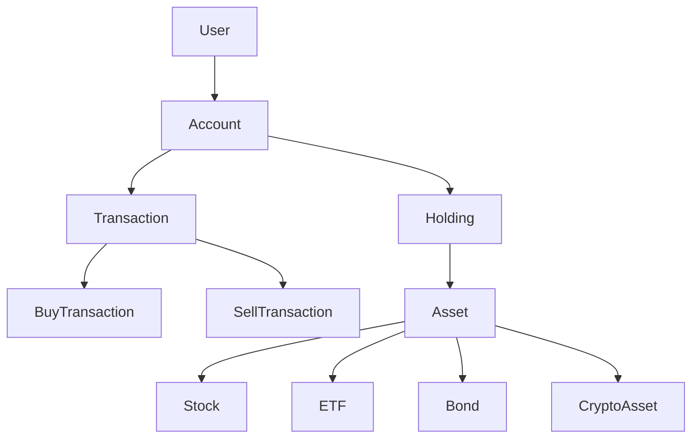

---

## 2. Package architecture

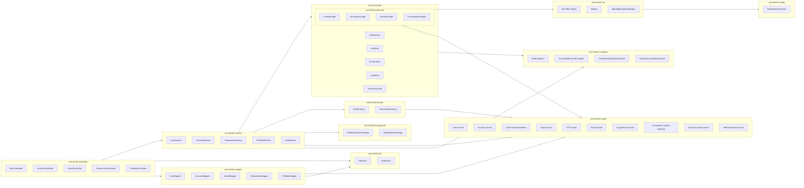

Rules:

- Controllers contain **no SQL** and **no business rules**.
- DAOs contain **no business rules** — only persistence + mapping.
- Services own all financial rules (validating buys/sells, computing portfolio
  value, computing risk).

---

## 3. Class diagram — domain model (inheritance)

The polymorphic hierarchies are modeled as `sealed interface` + `record`
implementations. Records give us encapsulation (private final fields +
accessor methods) and immutability for free.

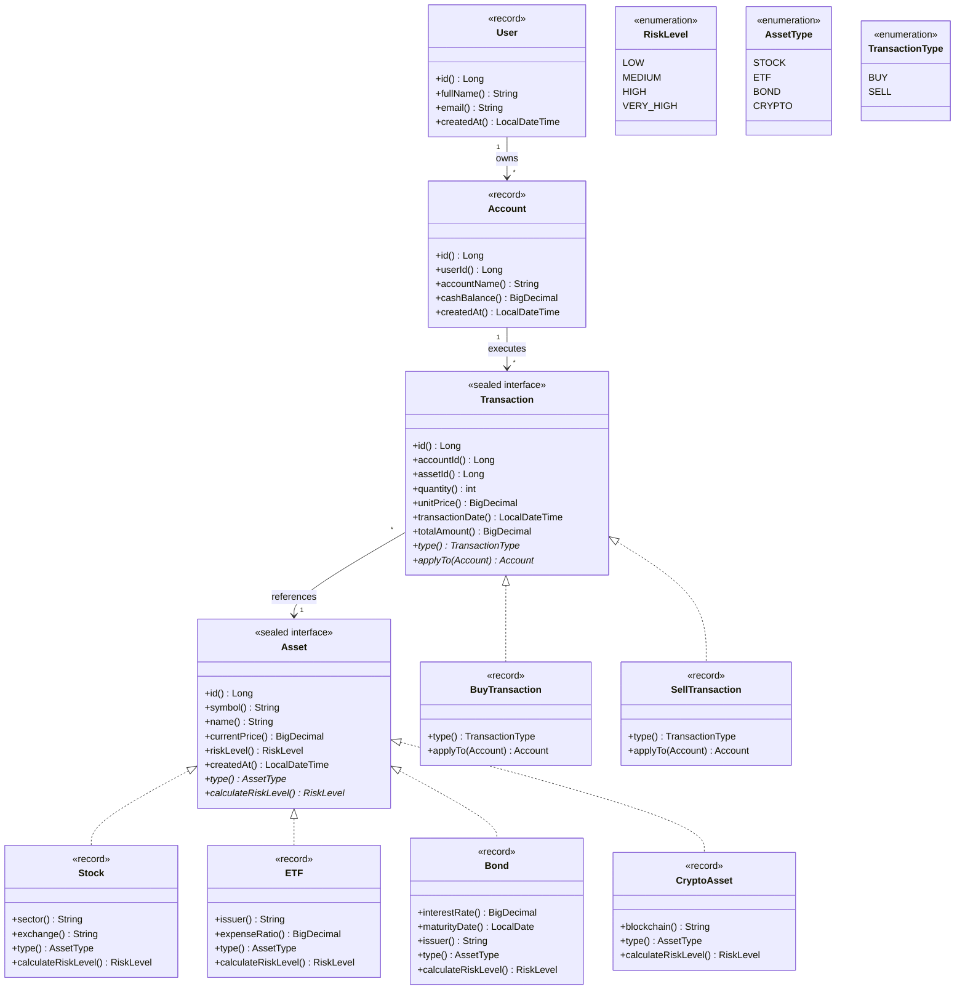

This satisfies: **encapsulation** (records have private final fields +
accessor methods, no setters), **abstraction** (sealed interfaces hide
the concrete subtype), **inheritance** (records `implements` the sealed
interface), **polymorphism** (`calculateRiskLevel()`, `applyTo()` behave
differently per subtype), and **`@Override`** on every concrete method.

> Why sealed instead of `abstract class`?
> A `sealed interface` lists every allowed implementer in a `permits`
> clause. The compiler verifies exhaustiveness in `switch` expressions
> over the family — so `AssetFactory` doesn't need a `default` branch and
> adding a new subtype causes a compile-time error in every consumer.

> Why `applyTo(Account) Account` and not `applyTo(Account, Asset) void`?
> Records are immutable, so `applyTo` returns a new `Account` with the
> updated cash balance instead of mutating the input. The cash debit/credit
> is also enforced atomically inside `sp_buy_asset`/`sp_sell_asset` (see
> §8) — `applyTo` keeps the Template Method demonstrable in pure Java.

---

## 4. Class diagram — DAO layer (genericity + interfaces)

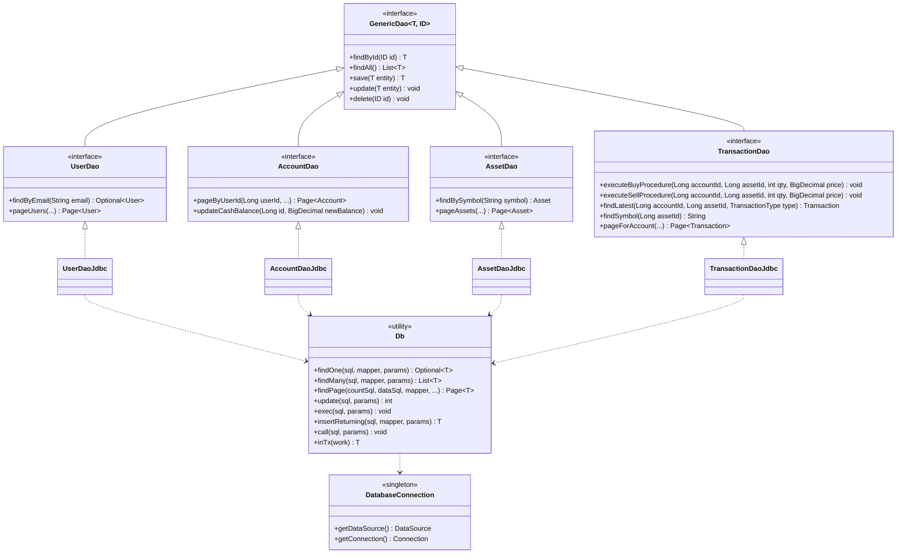

> `T save(T entity)` (not `void`): records are immutable, so the DAO can't
> mutate `entity.id` after `INSERT ... OUTPUT INSERTED.id`. Instead it
> returns a new record with the generated id (and `created_at`) populated.

This satisfies: **DAO architecture**, **interfaces**, **genericity**,
**reusability**.

---

## 5. Class diagram — service layer

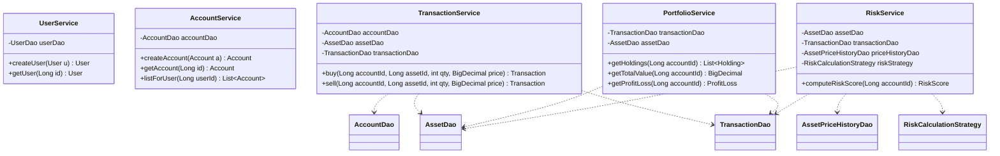

---

## 6. Custom exceptions

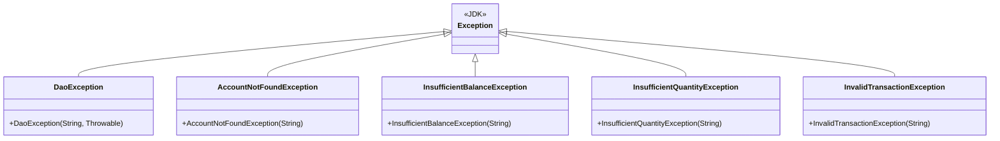

---

## 6.5. Design patterns used

A small, deliberate set of patterns — chosen so each one earns its place
without overcomplicating the project.

| Pattern             | Where it lives                                            | Why                                                                                                         |
| ------------------- | --------------------------------------------------------- | ----------------------------------------------------------------------------------------------------------- |
| **DAO**             | `dao/*` package                                           | Required by the brief; isolates persistence from business logic.                                            |
| **Generic DAO**     | `GenericDao<T, ID>`                                       | Removes duplication across UserDao / AccountDao / AssetDao / TransactionDao.                                |
| **Singleton**       | `DatabaseConnection`                                      | Single shared `DataSource` / HikariCP pool, lazily initialized with double-checked locking, thread-safe.    |
| **Template Method** | `Asset` / `Transaction` sealed interfaces                 | The interface fixes the algorithm shape (`calculateRiskLevel`, `type`, `applyTo`); each `record` `@Override`s the steps. |
| **Factory Method**  | `AssetFactory`, `TransactionFactory`                      | Modern `switch` expression over the sealed request interface — compiler-checked exhaustive, no `if/else` chain, no `default` branch. |
| **Strategy**        | `RiskCalculationStrategy` + `VolatilityRiskStrategy`      | Lets us swap volatility-based risk for a different formula (e.g. fixed-mapping) without touching `RiskService`.  |
| **DTO + Mapper**    | `dto/{request,response}/*` (records), `mapper/*` (static) | API contracts (records with validation annotations) are decoupled from domain models; mappers do the translation. |
| **JDBC Helper**     | `util/Db`                                                 | One canonical place for `Connection` / `PreparedStatement` / `ResultSet` / `try-with-resources`. DAO methods stay 1-3 lines while the JDBC ceremony stays demonstrably present. |

### Factory Method — Asset & Transaction creation

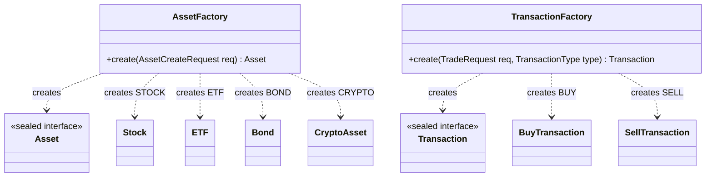

Pseudocode (real form — `switch` on a sealed request interface):

```java
public final class AssetFactory {
    private AssetFactory() {}

    public static Asset create(AssetCreateRequest req) {
        return switch (req) {
            case StockCreateRequest s -> new Stock(
                    null, s.symbol().trim(), s.name().trim(),
                    s.currentPrice(), RiskLevel.HIGH, null,
                    s.sector(), s.exchange());
            case EtfCreateRequest e -> new ETF(
                    null, e.symbol().trim(), e.name().trim(),
                    e.currentPrice(), RiskLevel.MEDIUM, null,
                    e.issuer(), e.expenseRatio());
            case BondCreateRequest b -> new Bond(
                    null, b.symbol().trim(), b.name().trim(),
                    b.currentPrice(), RiskLevel.LOW, null,
                    b.interestRate(), b.maturityDate(), b.issuer());
            case CryptoCreateRequest c -> new CryptoAsset(
                    null, c.symbol().trim(), c.name().trim(),
                    c.currentPrice(), RiskLevel.VERY_HIGH, null,
                    c.blockchain());
        };
    }
}
```

No `default` branch is needed — `AssetCreateRequest` is a `sealed
interface permits StockCreateRequest, EtfCreateRequest, BondCreateRequest,
CryptoCreateRequest`, so the compiler enforces exhaustiveness. Adding a
fifth subtype is a compile-time error here until you add the case.

### Strategy — risk calculation (volatility-based)

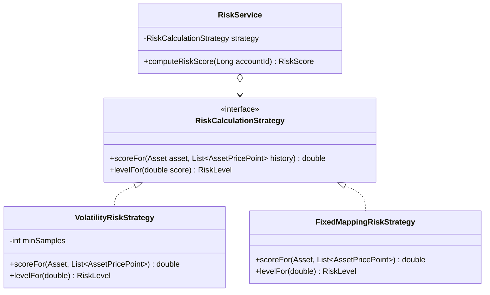

Algorithm in `VolatilityRiskStrategy`:

1. Pull the last N price points from `asset_price_history` for the asset
   (default N = 30).
2. Compute log returns `r_i = ln(p_i / p_(i-1))`.
3. `volatility = stddev(r_i)`.
4. Map volatility -> `RiskLevel`:

   | Daily volatility (sigma) | RiskLevel   |
   | ------------------------ | ----------- |
   | sigma < 0.01             | `LOW`       |
   | 0.01 <= sigma < 0.03     | `MEDIUM`    |
   | 0.03 <= sigma < 0.06     | `HIGH`      |
   | sigma >= 0.06            | `VERY_HIGH` |

5. If history has fewer than `minSamples` (default 5), fall back to the
   asset subclass's `calculateRiskLevel()` (Template Method default).

Portfolio-level score in `RiskService`:

```text
score = sum_over_holdings( holding.currentValue * holding.assetVolatility )
        / sum_over_holdings( holding.currentValue )
level = strategy.levelFor(score)
```

This keeps `RiskService` ignorant of *how* risk is computed — only that a
strategy exists.

### Singleton — `DatabaseConnection`

```java
public final class DatabaseConnection {
    private static volatile DataSource INSTANCE;

    private DatabaseConnection() {}

    public static DataSource getDataSource() {
        if (INSTANCE == null) {
            synchronized (DatabaseConnection.class) {
                if (INSTANCE == null) {
                    INSTANCE = buildHikariDataSource();
                }
            }
        }
        return INSTANCE;
    }

    public static Connection getConnection() throws SQLException {
        return getDataSource().getConnection();
    }
}
```

### DTO + Mapper

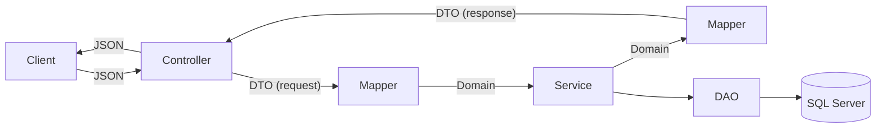

- `dto/request/*` — what comes in over HTTP (e.g. `TradeRequest`,
  `AssetCreateRequest`).
- `dto/response/*` — what goes out (e.g. `TransactionResponse`,
  `PortfolioResponse`).
- `mapper/*` — pure functions translating both directions.
- Domain models in `model/*` stay free of Jackson annotations; this keeps
  the persistence/business core independent of the HTTP layer.

---

## 7. ER diagram — SQL Server schema

```mermaid
erDiagram
    users ||--o{ accounts : owns
    accounts ||--o{ transactions : executes
    assets ||--o{ transactions : referenced_by
    assets ||--o| asset_details_stock : "1:1 (if STOCK)"
    assets ||--o| asset_details_bond : "1:1 (if BOND)"
    assets ||--o| asset_details_crypto : "1:1 (if CRYPTO)"
    assets ||--o{ asset_price_history : has_history

    users {
        BIGINT id PK
        NVARCHAR full_name
        NVARCHAR email UK
        DATETIME2 created_at
    }

    accounts {
        BIGINT id PK
        BIGINT user_id FK
        NVARCHAR account_name
        DECIMAL cash_balance "CHECK >= 0"
        DATETIME2 created_at
    }

    assets {
        BIGINT id PK
        NVARCHAR symbol UK
        NVARCHAR name
        NVARCHAR asset_type "STOCK|ETF|BOND|CRYPTO"
        DECIMAL current_price "CHECK > 0"
        NVARCHAR risk_level "LOW|MEDIUM|HIGH|VERY_HIGH"
        DATETIME2 created_at
    }

    asset_details_stock {
        BIGINT asset_id PK_FK
        NVARCHAR sector
        NVARCHAR exchange_name
    }

    asset_details_bond {
        BIGINT asset_id PK_FK
        DECIMAL interest_rate
        DATE maturity_date
        NVARCHAR issuer
    }

    asset_details_crypto {
        BIGINT asset_id PK_FK
        NVARCHAR blockchain
    }

    transactions {
        BIGINT id PK
        BIGINT account_id FK
        BIGINT asset_id FK
        NVARCHAR transaction_type "BUY|SELL"
        INT quantity "CHECK > 0"
        DECIMAL unit_price "CHECK > 0"
        DATETIME2 transaction_date
    }

    asset_price_history {
        BIGINT id PK
        BIGINT asset_id FK
        DECIMAL price "CHECK > 0"
        DATETIME2 recorded_at
    }

    audit_logs {
        BIGINT id PK
        NVARCHAR entity_name
        BIGINT entity_id
        NVARCHAR action_type
        NVARCHAR description
        DATETIME2 created_at
    }
```

---

## 8. Sequence diagram — `POST /api/v1/transactions/buy`

The atomic part of the buy (lock account, validate cash, update balance,
insert transaction row, insert audit log) lives in the `sp_buy_asset`
stored procedure. Java only does the pre-flight existence checks and the
read-back for the response.

```mermaid
sequenceDiagram
    participant Client
    participant TC as TransactionController
    participant TS as TransactionService
    participant AD as AccountDao
    participant AsD as AssetDao
    participant TD as TransactionDao
    participant SP as sp_buy_asset
    participant DB as SQL Server

    Client->>TC: POST /api/v1/transactions/buy {accountId, assetId, quantity, unitPrice}
    TC->>TS: buy(TradeRequest)
    TS->>AD: findById(accountId)
    AD->>DB: SELECT ... FROM accounts WHERE id = ?
    DB-->>AD: row or null
    AD-->>TS: Account or null
    alt account null
        TS-->>TC: AccountNotFoundException
        TC-->>Client: 404 ACCOUNT_NOT_FOUND
    end
    TS->>AsD: findById(assetId)
    AsD-->>TS: Asset or null
    alt asset null
        TS-->>TC: AssetNotFoundException
        TC-->>Client: 404 ASSET_NOT_FOUND
    end

    TS->>TD: executeBuyProcedure(...)
    TD->>SP: CALL sp_buy_asset(?, ?, ?, ?)
    Note over SP,DB: SET XACT_ABORT ON; BEGIN TRANSACTION
    SP->>DB: SELECT cash_balance ... WITH (UPDLOCK, HOLDLOCK)
    alt cash_balance < quantity * unit_price
        SP-->>TD: RAISERROR 'INSUFFICIENT_BALANCE'
        TD-->>TS: InsufficientBalanceException (mapped)
        TS-->>TC: InsufficientBalanceException
        TC-->>Client: 409 INSUFFICIENT_BALANCE
    else sufficient funds
        SP->>DB: UPDATE accounts SET cash_balance = cash_balance - total
        SP->>DB: INSERT INTO transactions (...) VALUES ('BUY', ...)
        SP->>DB: INSERT INTO audit_logs (...) 'BUY_TRANSACTION_CREATED'
        Note over SP,DB: COMMIT
        SP-->>TD: ok
        TD-->>TS: ok
        TS->>TD: findLatest(accountId, assetId, BUY) + findSymbol(assetId)
        TD-->>TS: Transaction record + symbol
        TS-->>TC: TransactionResponse
        TC-->>Client: 201 Created
    end
```

---

## 9. Sequence diagram — `GET /api/v1/accounts/{id}/portfolio`

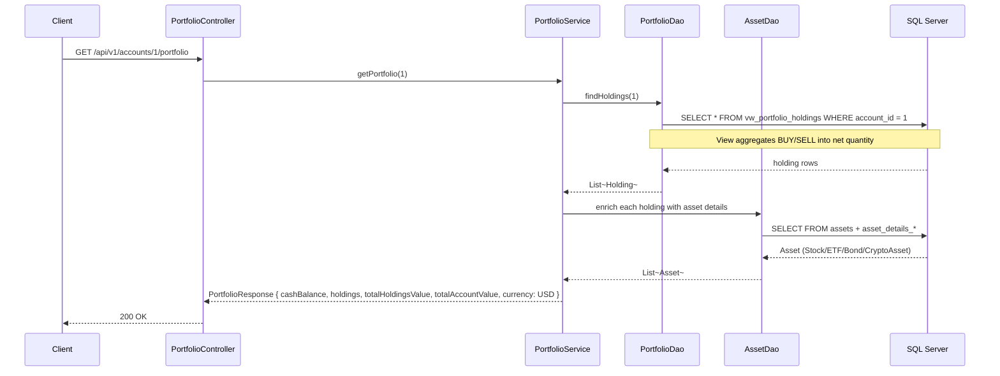

---

## 10. State diagram — Transaction lifecycle

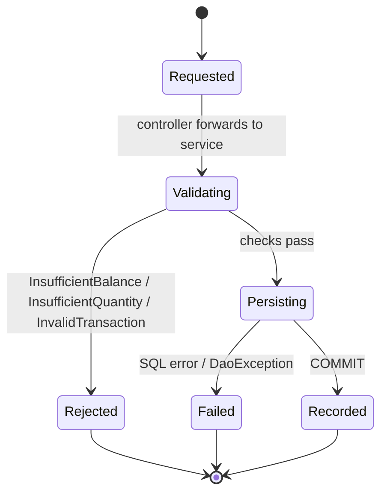

---

## 11. Requirement traceability

| Requirement                | Where it shows up in this design                                                  |
| -------------------------- | --------------------------------------------------------------------------------- |
| Encapsulation              | All domain models are `record` types (private final fields + accessor methods, no setters) — section 3 |
| Abstraction                | `Asset` and `Transaction` are `sealed interface`s                                 |
| Inheritance                | `Stock`, `ETF`, `Bond`, `CryptoAsset` `implements Asset`; `BuyTransaction`, `SellTransaction` `implements Transaction` |
| Polymorphism + `@Override` | `calculateRiskLevel()`, `type()`, `applyTo()` `@Override`'d per record subtype     |
| Interfaces                 | `GenericDao`, `UserDao`, `AccountDao`, `AssetDao`, `TransactionDao`, `RiskCalculationStrategy`, `Asset`, `Transaction` |
| Genericity                 | `GenericDao<T, ID>`, `Page<T>`, `Db.findOne(..., RowMapper<T>, ...)`              |
| Layered packages           | Section 2: controller / service / dao / model / dto / mapper / factory / strategy / exception / config / util |
| DAO architecture           | Section 4: interfaces + JDBC implementations, all going through `util/Db`         |
| JDBC                       | `Db` helper centralizes `Connection` / `PreparedStatement` / `ResultSet` / `try-with-resources`; `DatabaseConnection` is the singleton pool |
| SQL injection prevention   | All DAO queries use `?` placeholders; sort fields go through `SqlSort` whitelist  |
| ResultSet mapping          | One private static `map(ResultSet rs)` per DAO, used as a `Db.RowMapper<T>`       |
| Custom exceptions          | Section 6 hierarchy, mapped to HTTP status + stable `Error.code` by `GlobalExceptionHandler` |
| SQL skills                 | ER diagram (constraints), views (`vw_portfolio_holdings`, …), stored procs (`sp_buy_asset`, `sp_sell_asset`), indexes |
| Transactional integrity    | `sp_buy_asset` / `sp_sell_asset` wrap balance + transaction + audit insert in a single SQL transaction (`BEGIN TRANSACTION` / `COMMIT` / `ROLLBACK`) — section 8 |
| Dockerization              | `sqlserver` + `finrisk-api` Compose services (api published on host `:18080`)     |
| Design patterns            | Section 6.5: DAO, Generic DAO, Singleton, Template Method, Factory Method, Strategy, DTO + Mapper, JDBC Helper |
| Volatility-based risk      | `VolatilityRiskStrategy` (section 6.5) + `asset_price_history` table              |
| API versioning             | All paths under `/api/v1` in `openapi.yaml`                                       |
| Pagination                 | `Page<T>` envelope + `page` / `size` / `sort` query params on all list endpoints  |
| Modern Java syntax         | Records, sealed interfaces, `switch` expressions on sealed types, text blocks for SQL, `var` for locals |

---

## 12. Confirmed design decisions

| Topic              | Decision                                                                                                                                  |
| ------------------ | ----------------------------------------------------------------------------------------------------------------------------------------- |
| Authentication     | **None.** API is open. Authn/authz is explicitly out of scope.                                                                            |
| Currency           | **USD only.** All `cashBalance`, `unitPrice`, and `currentPrice` values are USD. No FX conversion logic.                                  |
| Risk score formula | **Volatility-based.** `RiskService` derives the risk level of each holding from the standard deviation of returns in `asset_price_history`. The portfolio risk is the value-weighted average of per-asset volatility. |
| ETF default risk   | `ETF.calculateRiskLevel()` returns **`MEDIUM`** when there is insufficient price history.                                                 |
| Pagination         | **Enabled on all list endpoints** (`page`, `size`, optional `sort`). Responses use a generic `Page<T>` envelope.                          |
| API versioning     | All endpoints live under **`/api/v1`**.                                                                                                   |
| API contracts      | **DTOs are separate from domain models.** Mappers translate `Domain <-> DTO`. Domain models never leak directly into JSON.                |
