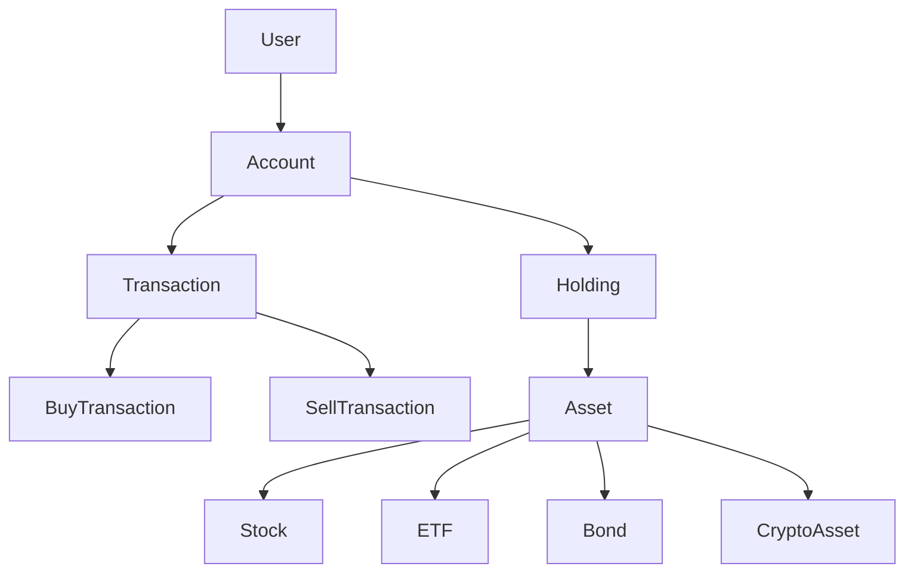
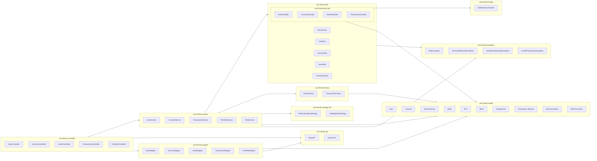
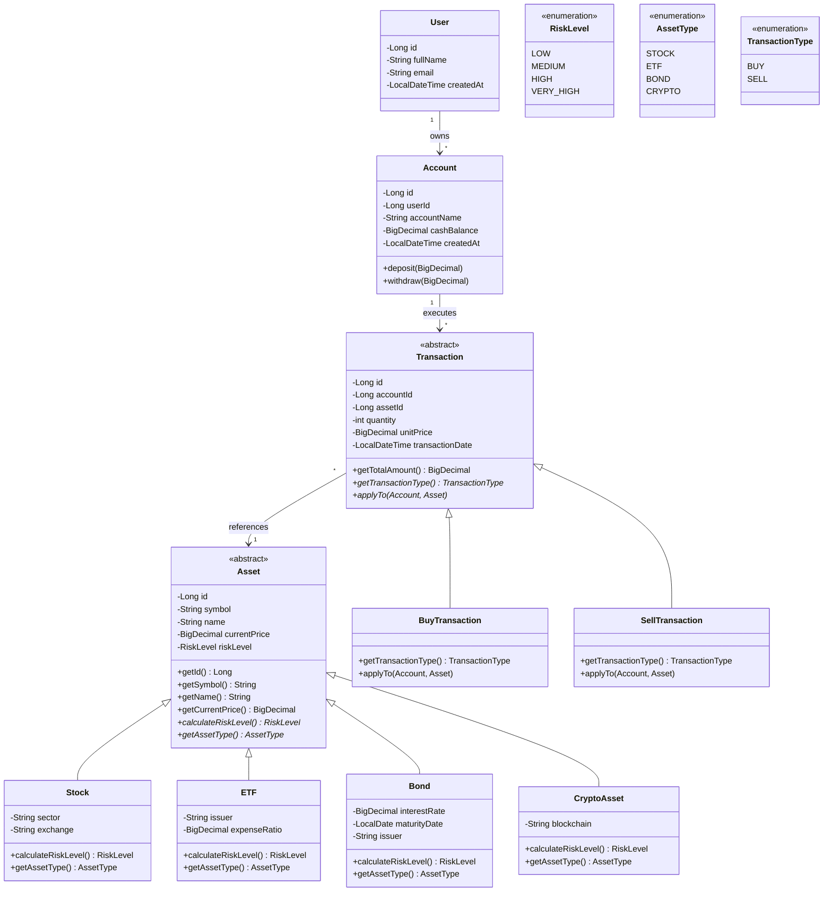
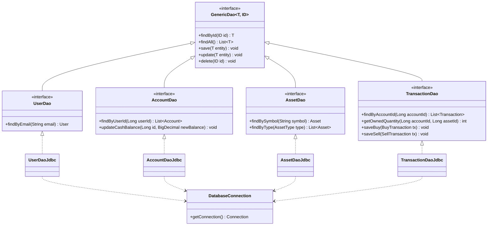
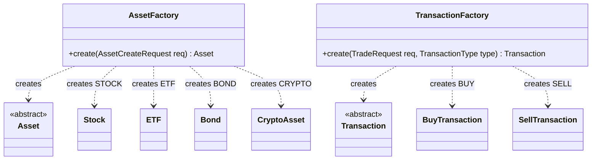
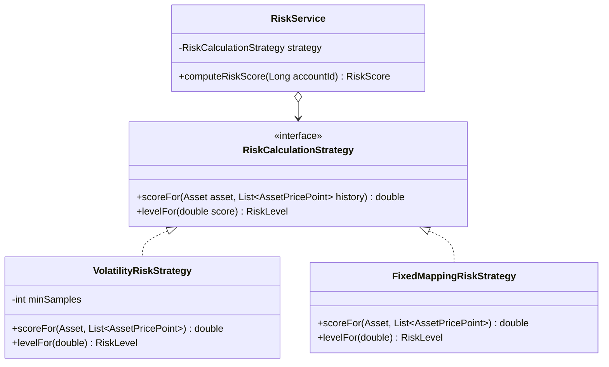
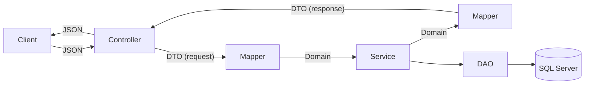
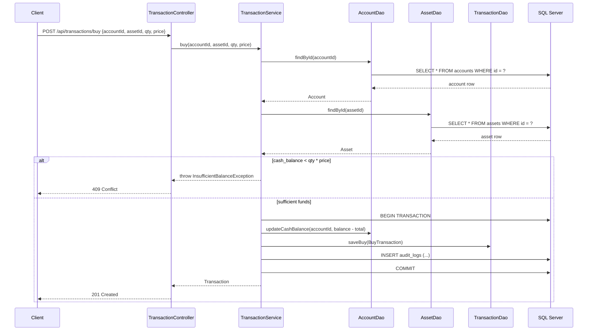
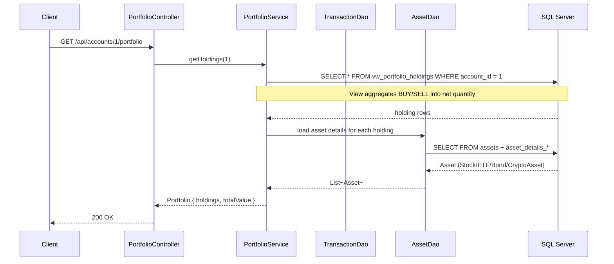
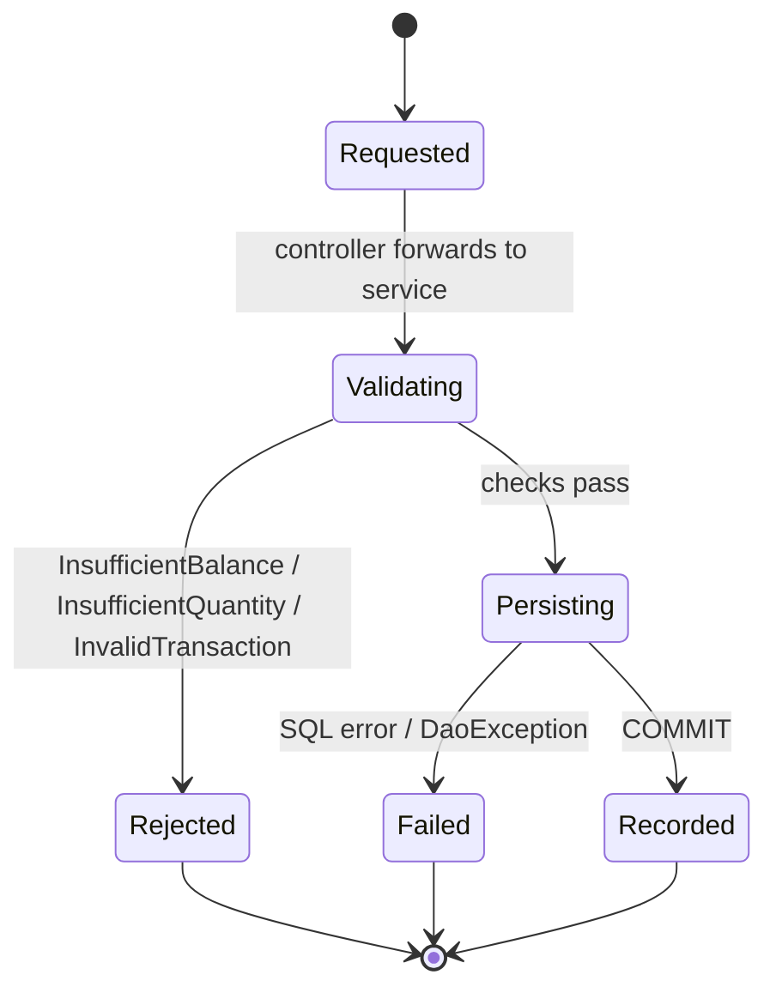

# FinRisk API — UML & Architecture Diagrams

This document captures the design of the **FinRisk** API before any code is
written. It is meant to be reviewed alongside [`openapi.yaml`](openapi.yaml).

> Stack assumption: **Java + JDBC + SQL Server**, layered as
> `controller -> service -> dao -> SQL Server`.

---

## 1. Domain overview

The system models a user's investment portfolio. Each user owns one or more
investment accounts. Accounts hold cash and execute buy/sell transactions
against assets (stocks, ETFs, bonds, crypto). The API derives holdings,
portfolio value, profit/loss, and a risk score from the transaction history.



---

## 2. Package architecture



Rules:

- Controllers contain **no SQL** and **no business rules**.
- DAOs contain **no business rules** — only persistence + mapping.
- Services own all financial rules (validating buys/sells, computing portfolio
  value, computing risk).

---

## 3. Class diagram — domain model (inheritance)



This satisfies: **encapsulation**, **abstraction**, **inheritance**,
**polymorphism** (`calculateRiskLevel`, `applyTo`), and **`@Override`** in
child classes.

---

## 4. Class diagram — DAO layer (genericity + interfaces)



This satisfies: **DAO architecture**, **interfaces**, **genericity**,
**reusability**.

---

## 5. Class diagram — service layer


---

## 6. Custom exceptions


---

## 6.5. Design patterns used

A small, deliberate set of patterns — chosen so each one earns its place
without overcomplicating the project.

| Pattern             | Where it lives                                 | Why                                                                                                         |
| ------------------- | ---------------------------------------------- | ----------------------------------------------------------------------------------------------------------- |
| **DAO**             | `dao/*` package                                | Required by the brief; isolates persistence from business logic.                                            |
| **Generic DAO**     | `GenericDao<T, ID>`                            | Removes duplication across UserDao / AccountDao / AssetDao / TransactionDao.                                |
| **Singleton**       | `DatabaseConnection`                           | Single shared `DataSource` / connection pool, lazily initialized and thread-safe.                           |
| **Template Method** | `Asset` (`calculateRiskLevel`, `getAssetType`) | Parent class fixes the algorithm shape; subclasses fill the steps.                                          |
| **Factory Method**  | `AssetFactory`, `TransactionFactory`           | Translates a typed request (e.g. `assetType=BOND`) into the right concrete subclass without `if/else` soup. |
| **Strategy**        | `RiskCalculationStrategy`                      | Lets us swap volatility-based risk for a different formula (e.g. fixed-mapping) without touching services.  |
| **DTO + Mapper**    | `dto/*`, `mapper/*`                            | API contracts (request/response) are decoupled from domain models; mappers do the translation.              |

### Factory Method — Asset & Transaction creation



Pseudocode:

```java
public final class AssetFactory {
    public static Asset create(AssetCreateRequest req) {
        return switch (req.getAssetType()) {
            case STOCK  -> new Stock(req.getSymbol(), req.getName(), req.getCurrentPrice(),
                                     req.getStockDetails().getSector(),
                                     req.getStockDetails().getExchange());
            case ETF    -> new ETF(req.getSymbol(), req.getName(), req.getCurrentPrice(),
                                   req.getEtfDetails().getIssuer(),
                                   req.getEtfDetails().getExpenseRatio());
            case BOND   -> new Bond(req.getSymbol(), req.getName(), req.getCurrentPrice(),
                                    req.getBondDetails().getInterestRate(),
                                    req.getBondDetails().getMaturityDate(),
                                    req.getBondDetails().getIssuer());
            case CRYPTO -> new CryptoAsset(req.getSymbol(), req.getName(), req.getCurrentPrice(),
                                           req.getCryptoDetails().getBlockchain());
        };
    }
}
```

### Strategy — risk calculation (volatility-based)



Algorithm in `VolatilityRiskStrategy`:

1. Pull the last N price points from `asset_price_history` for the asset
   (default N = 30).
2. Compute log returns `r_i = ln(p_i / p_(i-1))`.
3. `volatility = stddev(r_i)`.
4. Map volatility -> `RiskLevel`:

   | Daily volatility (sigma) | RiskLevel   |
   | ------------------------ | ----------- |
   | sigma < 0.01             | `LOW`       |
   | 0.01 <= sigma < 0.03     | `MEDIUM`    |
   | 0.03 <= sigma < 0.06     | `HIGH`      |
   | sigma >= 0.06            | `VERY_HIGH` |

5. If history has fewer than `minSamples` (default 5), fall back to the
   asset subclass's `calculateRiskLevel()` (Template Method default).

Portfolio-level score in `RiskService`:

```text
score = sum_over_holdings( holding.currentValue * holding.assetVolatility )
        / sum_over_holdings( holding.currentValue )
level = strategy.levelFor(score)
```

This keeps `RiskService` ignorant of *how* risk is computed — only that a
strategy exists.

### Singleton — `DatabaseConnection`

```java
public final class DatabaseConnection {
    private static volatile DataSource INSTANCE;

    private DatabaseConnection() {}

    public static DataSource getDataSource() {
        if (INSTANCE == null) {
            synchronized (DatabaseConnection.class) {
                if (INSTANCE == null) {
                    INSTANCE = buildHikariDataSource();
                }
            }
        }
        return INSTANCE;
    }

    public static Connection getConnection() throws SQLException {
        return getDataSource().getConnection();
    }
}
```

### DTO + Mapper



- `dto/request/*` — what comes in over HTTP (e.g. `TradeRequest`,
  `AssetCreateRequest`).
- `dto/response/*` — what goes out (e.g. `TransactionResponse`,
  `PortfolioResponse`).
- `mapper/*` — pure functions translating both directions.
- Domain models in `model/*` stay free of Jackson annotations; this keeps
  the persistence/business core independent of the HTTP layer.

---

## 7. ER diagram — SQL Server schema

```mermaid
erDiagram
    users ||--o{ accounts : owns
    accounts ||--o{ transactions : executes
    assets ||--o{ transactions : referenced_by
    assets ||--o| asset_details_stock : "1:1 (if STOCK)"
    assets ||--o| asset_details_bond : "1:1 (if BOND)"
    assets ||--o| asset_details_crypto : "1:1 (if CRYPTO)"
    assets ||--o{ asset_price_history : has_history

    users {
        BIGINT id PK
        NVARCHAR full_name
        NVARCHAR email UK
        DATETIME2 created_at
    }

    accounts {
        BIGINT id PK
        BIGINT user_id FK
        NVARCHAR account_name
        DECIMAL cash_balance "CHECK >= 0"
        DATETIME2 created_at
    }

    assets {
        BIGINT id PK
        NVARCHAR symbol UK
        NVARCHAR name
        NVARCHAR asset_type "STOCK|ETF|BOND|CRYPTO"
        DECIMAL current_price "CHECK > 0"
        NVARCHAR risk_level "LOW|MEDIUM|HIGH|VERY_HIGH"
        DATETIME2 created_at
    }

    asset_details_stock {
        BIGINT asset_id PK_FK
        NVARCHAR sector
        NVARCHAR exchange_name
    }

    asset_details_bond {
        BIGINT asset_id PK_FK
        DECIMAL interest_rate
        DATE maturity_date
        NVARCHAR issuer
    }

    asset_details_crypto {
        BIGINT asset_id PK_FK
        NVARCHAR blockchain
    }

    transactions {
        BIGINT id PK
        BIGINT account_id FK
        BIGINT asset_id FK
        NVARCHAR transaction_type "BUY|SELL"
        INT quantity "CHECK > 0"
        DECIMAL unit_price "CHECK > 0"
        DATETIME2 transaction_date
    }

    asset_price_history {
        BIGINT id PK
        BIGINT asset_id FK
        DECIMAL price "CHECK > 0"
        DATETIME2 recorded_at
    }

    audit_logs {
        BIGINT id PK
        NVARCHAR entity_name
        BIGINT entity_id
        NVARCHAR action_type
        NVARCHAR description
        DATETIME2 created_at
    }
```

---

## 8. Sequence diagram — `POST /api/transactions/buy`



---

## 9. Sequence diagram — `GET /api/accounts/{id}/portfolio`



---

## 10. State diagram — Transaction lifecycle



---

## 11. Requirement traceability

| Requirement                | Where it shows up in this design                                                  |
| -------------------------- | --------------------------------------------------------------------------------- |
| Encapsulation              | All model classes in section 3 — private fields, getters/setters                  |
| Abstraction                | `Asset` and `Transaction` are abstract                                            |
| Inheritance                | `Stock`, `ETF`, `Bond`, `CryptoAsset` extend `Asset`; Buy/Sell extend Transaction |
| Polymorphism + `@Override` | `calculateRiskLevel()`, `applyTo()` overridden per subtype                        |
| Interfaces                 | `GenericDao`, `UserDao`, `AccountDao`, `AssetDao`, `TransactionDao`, `RiskCalculationStrategy` |
| Genericity                 | `GenericDao<T, ID>`                                                               |
| Layered packages           | Section 2: controller / service / dao / model / dto / mapper / factory / strategy / exception / config |
| DAO architecture           | Section 4: interfaces + JDBC implementations                                      |
| JDBC                       | `DatabaseConnection`, `Connection`, `PreparedStatement`, `ResultSet`              |
| SQL injection prevention   | All DAO queries use `?` placeholders                                              |
| ResultSet mapping          | `mapResultSetToUser`, `mapResultSetToAsset`, `mapResultSetToTransaction`          |
| Custom exceptions          | Section 6 hierarchy                                                               |
| SQL skills                 | ER diagram (constraints), views, stored procs, indexes (see openapi + DDL)        |
| Transactional integrity    | Section 8 sequence diagram (BEGIN/COMMIT around buy)                              |
| Dockerization              | `sqlserver` + `finrisk-api` Compose services                                      |
| Design patterns            | Section 6.5: DAO, Generic DAO, Singleton, Template Method, Factory Method, Strategy, DTO + Mapper |
| Volatility-based risk      | `VolatilityRiskStrategy` (section 6.5) + `asset_price_history` table              |
| API versioning             | All paths under `/api/v1` in `openapi.yaml`                                       |
| Pagination                 | `Page<T>` envelope + `page` / `size` / `sort` query params on all list endpoints  |

---

## 12. Confirmed design decisions

| Topic              | Decision                                                                                                                                  |
| ------------------ | ----------------------------------------------------------------------------------------------------------------------------------------- |
| Authentication     | **None.** API is open. Authn/authz is explicitly out of scope.                                                                            |
| Currency           | **USD only.** All `cashBalance`, `unitPrice`, and `currentPrice` values are USD. No FX conversion logic.                                  |
| Risk score formula | **Volatility-based.** `RiskService` derives the risk level of each holding from the standard deviation of returns in `asset_price_history`. The portfolio risk is the value-weighted average of per-asset volatility. |
| ETF default risk   | `ETF.calculateRiskLevel()` returns **`MEDIUM`** when there is insufficient price history.                                                 |
| Pagination         | **Enabled on all list endpoints** (`page`, `size`, optional `sort`). Responses use a generic `Page<T>` envelope.                          |
| API versioning     | All endpoints live under **`/api/v1`**.                                                                                                   |
| API contracts      | **DTOs are separate from domain models.** Mappers translate `Domain <-> DTO`. Domain models never leak directly into JSON.                |
